Clustering successful films
================

Introduction
============

What makes a film successful? Is it how well rated it is by the critics? Whether fans love it and it becomes a cult classic? How many oscars it wins? Or, how much money it makes at the box office? All of these seem to be good ways of assessing whether a film is successful, but can we combine these criteria together to find which films are successful -- or unsuccessful -- all round? In this project, I am going to try and do this by looking at 10 years of film releases (2008 - 2017). Using [IMDB](http://www.imdb.com), I will look at how films are rated by critics, whether they are loved by fans and if they have made lots of money. Then, using clustering analyses I'll identify the best and worst films of the last 10 years. Clustering, an unsupervised learning method, does not necessarily yield a 'right' answer, so the project will also serve to explore the differences between different types of clustering analyses and the effect of transforming and scaling data.

All of the project is carried out using **R**.

Note: I am only selecting films that were released up until the end of 2017, and not the present day (March 2018) as newer films may still be on in cinemas and they may not have been fully reviewed yet.

Web scraping
============

``` r
library(rvest)
library(scatterplot3d)
library(NbClust)
library(reshape2)
library(ggplot2)
library(geoR)
```

To start with I am going to head to the advanced search page on [IMDB](https://www.imdb.com/search/title) and set up a search with the following parameters:

-   Title type: Feature film.
-   Release date: 2008 to 2017.
-   Minimum number of votes: 10000 (I want to eliminate non-mainstream films as the data is usually incomplete).
-   Display 5000 titles (this should select all of the films).

[The full search can be found by clicking here](https://www.imdb.com/search/title?title_type=feature&release_date=2008-01-01,2017-12-31&num_votes=10000,&count=5000&sort=user_rating,desc).

I'm going to use the [SelectorGadget](http://selectorgadget.com) chrome extension to generate CSS selectors that can be used for the web scraper in R. I'm going to extract four pieces of data:

-   Film title
-   IMDB user rating
-   Critic metascore
-   Gross US box office takings

``` r
imdb_url <- "https://www.imdb.com/search/title?title_type=feature&release_date=2008-01-01,2017-12-31&num_votes=10000,&count=5000&sort=user_rating,desc"
imdb_html <- read_html(imdb_url)
imdb_data_raw <- html_nodes(imdb_html, ".lister-item-header a , .ratings-imdb-rating strong, 
                            .metascore, .ghost~ .text-muted+ span")
imdb_data_raw2 <- as.character(imdb_data_raw)
imdb_data <- html_text(imdb_data_raw)
length(imdb_data)
```

    ## [1] 9910

So now I have all the data for the films in its raw html format, and as a filtered version with all the html code removed. I've scraped the data of 2692 films and there should be 4 variables for each film, so there should be 10768 elements in the `imdb_data` vector. However, there are only 9910 elements so some values must be missing.

Unfortunately, the scraper does not insert `NAs` for missing values so I will need to write some code to do this for me. If I look at the raw html data it shows that the different variables are encoded in different ways:

``` r
head(imdb_data_raw2, n = 10)
```

    ##  [1] "<a href=\"/title/tt5813916/?ref_=adv_li_tt\">Dag II</a>"                   
    ##  [2] "<strong>9.6</strong>"                                                      
    ##  [3] "<a href=\"/title/tt5354160/?ref_=adv_li_tt\">Aynabaji</a>"                 
    ##  [4] "<strong>9.4</strong>"                                                      
    ##  [5] "<a href=\"/title/tt0468569/?ref_=adv_li_tt\">The Dark Knight</a>"          
    ##  [6] "<strong>9.0</strong>"                                                      
    ##  [7] "<span class=\"metascore  favorable\">82        </span>"                    
    ##  [8] "<span name=\"nv\" data-value=\"534,858,444\">$534.86M</span>"              
    ##  [9] "<a href=\"/title/tt6316138/?ref_=adv_li_tt\">Ayla: The Daughter of War</a>"
    ## [10] "<strong>9.0</strong>"

I'm going to build a dataframe to hold all of the cleaned film information. Then I'll find which elements in the raw data are film titles. Then I'll make a loop that will identify if the three other variables associated with each title are present, and if so copy it to the dataframe with the cleaned data. Any films with missing values will have `NAs` inserted.

``` r
a <- which(grepl("title", imdb_data_raw2))
imdb_clean <- data.frame(title = character(), rating = character(), metascore = character(), 
                         box_office = character(), stringsAsFactors = FALSE)
b = 1
for (i in a) {
  imdb_clean[b,1] <- imdb_data[i]
  if (all(grepl("title", imdb_data_raw2[(i+1):(i+3)]) == FALSE)) {
    imdb_clean[b,2:4] <- imdb_data[(i+1):(i+3)]
  }
  b = b+1
}
head(imdb_clean, n = 10)
```

    ##                         title rating  metascore box_office
    ## 1                      Dag II   <NA>       <NA>       <NA>
    ## 2                    Aynabaji   <NA>       <NA>       <NA>
    ## 3             The Dark Knight    9.0 82           $534.86M
    ## 4   Ayla: The Daughter of War   <NA>       <NA>       <NA>
    ## 5                Vikram Vedha   <NA>       <NA>       <NA>
    ## 6                   Inception    8.8 74           $292.58M
    ## 7                    Drishyam   <NA>       <NA>       <NA>
    ## 8  Bilal: A New Breed of Hero    8.7 52             $0.49M
    ## 9                Interstellar    8.6 74           $188.02M
    ## 10                     Dangal   <NA>       <NA>       <NA>

``` r
str(imdb_clean)
```

    ## 'data.frame':    2692 obs. of  4 variables:
    ##  $ title     : chr  "Dag II" "Aynabaji" "The Dark Knight" "Ayla: The Daughter of War" ...
    ##  $ rating    : chr  NA NA "9.0" NA ...
    ##  $ metascore : chr  NA NA "82        " NA ...
    ##  $ box_office: chr  NA NA "$534.86M" NA ...

Even after only looking at the first 6 films, it seems that quite a few films have missing data. As I need complete data for each film, any film with missing data will be discarded from the dataset. I'm also going to convert the `rating`, `metascore` and `box_office` variables to numeric data (the '$' and 'M' will be removed from box office takings column before changing the data type).

``` r
imdb_clean <- na.omit(imdb_clean)
imdb_clean$rating <- as.numeric(imdb_clean$rating)
imdb_clean$metascore <- as.numeric(imdb_clean$metascore)
imdb_clean$box_office <- as.numeric(gsub("\\$|M", "", imdb_clean$box_office))
head(imdb_clean, n = 10)
```

    ##                         title rating metascore box_office
    ## 3             The Dark Knight    9.0        82     534.86
    ## 6                   Inception    8.8        74     292.58
    ## 8  Bilal: A New Breed of Hero    8.7        52       0.49
    ## 9                Interstellar    8.6        74     188.02
    ## 13                       Coco    8.5        81     209.43
    ## 14                   Whiplash    8.5        88      13.09
    ## 15                Untouchable    8.5        57      13.18
    ## 16           Django Unchained    8.4        81     162.81
    ## 17      The Dark Knight Rises    8.4        78     448.14
    ## 18             Kimi no na wa.    8.4        79       5.02

``` r
str(imdb_clean)
```

    ## 'data.frame':    2083 obs. of  4 variables:
    ##  $ title     : chr  "The Dark Knight" "Inception" "Bilal: A New Breed of Hero" "Interstellar" ...
    ##  $ rating    : num  9 8.8 8.7 8.6 8.5 8.5 8.5 8.4 8.4 8.4 ...
    ##  $ metascore : num  82 74 52 74 81 88 57 81 78 79 ...
    ##  $ box_office: num  534.86 292.58 0.49 188.02 209.43 ...
    ##  - attr(*, "na.action")=Class 'omit'  Named int [1:609] 1 2 4 5 7 10 11 12 21 22 ...
    ##   .. ..- attr(*, "names")= chr [1:609] "1" "2" "4" "5" ...

I now have a dataframe of 2083 films, with all films with missing data removed -- and all values formatted correctly.

Clustering
==========

K-means clustering
------------------

Before I start the clustering analyses I am going to take a look at the data.

``` r
summary(imdb_clean)
```

    ##     title               rating        metascore        box_office     
    ##  Length:2083        Min.   :1.500   Min.   :  7.00   Min.   :  0.000  
    ##  Class :character   1st Qu.:6.000   1st Qu.: 43.00   1st Qu.:  1.735  
    ##  Mode  :character   Median :6.600   Median : 56.00   Median : 19.450  
    ##                     Mean   :6.533   Mean   : 55.94   Mean   : 48.403  
    ##                     3rd Qu.:7.200   3rd Qu.: 69.00   3rd Qu.: 59.425  
    ##                     Max.   :9.000   Max.   :100.00   Max.   :936.660

Looking at the three numeric variables, I can see that they are all on different scales:

-   `rating`: film ratings range from 1.5 to 9.
-   `metascore`: film metascores range from 7 to 100.
-   `box_office`: box office takings range from $0 miliion to $936.66 million.

If I leave these values as they are then the results of the clustering analyses are going to be distorted. As the `box_office` variable covers a much larger range than the other variables, the films will probably only be clustered based on their box office takings. Below is a quick k-means clustering analysis (using 5 clusters) to demonstrate this.

``` r
set.seed(12)
unscaled <- kmeans(imdb_clean[,2:4], centers = 5, nstart = 50, iter.max = 20)
fig_cols <- c("red", "green", "deepskyblue", "darkorange", "deeppink", "forestgreen", "blue", 
              "purple", "turquoise", "pink")
scatterplot3d(imdb_clean$rating, imdb_clean$metascore, imdb_clean$box_office, 
              pch = 20, color = fig_cols[unscaled$cluster], cex.symbols = 0.6, cex.lab = 0.8,
              main = "K-means clustering with k = 5 (data untransformed and unscaled)",
              xlab = "IMDB user rating",
              ylab = "Metascore",
              zlab = "Box office takings ($Million)")
```

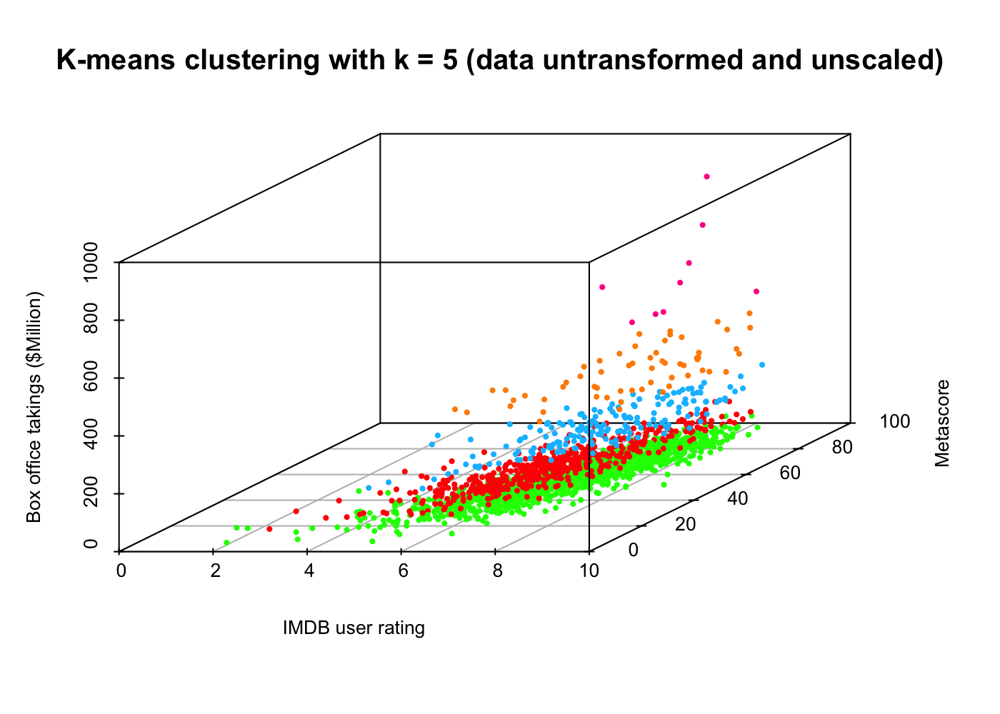

In the above figure it is clear that the films are clustered exclusively on box office takings. To correct this I am going to scale the data using the `scale` function so that each of the variables has a mean of 0 and and a standard deviation of 1.

``` r
imdb_clean_scale <- imdb_clean
imdb_clean_scale[,2:4] <- scale(imdb_clean_scale[,2:4])
summary(imdb_clean_scale)
```

    ##     title               rating           metascore           box_office     
    ##  Length:2083        Min.   :-5.59562   Min.   :-2.804376   Min.   :-0.6089  
    ##  Class :character   1st Qu.:-0.59271   1st Qu.:-0.741694   1st Qu.:-0.5871  
    ##  Mode  :character   Median : 0.07435   Median : 0.003163   Median :-0.3642  
    ##                     Mean   : 0.00000   Mean   : 0.000000   Mean   : 0.0000  
    ##                     3rd Qu.: 0.74140   3rd Qu.: 0.748021   3rd Qu.: 0.1387  
    ##                     Max.   : 2.74257   Max.   : 2.524219   Max.   :11.1747

``` r
lapply(imdb_clean_scale[,2:4], FUN =sd)
```

    ## $rating
    ## [1] 1
    ## 
    ## $metascore
    ## [1] 1
    ## 
    ## $box_office
    ## [1] 1

The distributions of the data have not been changed; notice how the mean and median of the `box_office` variable are quite different, and the range of values is much greater. You could argue that it would be sensible to transform the data (before scaling) but let's keep it as it is for now and try some transformations later on.

### Untransformed data

In k-means clustering, the number of clusters has to be specified when the analysis is run. First, I'm going to use the elbow method to see if there is an optimum number of clusters based on the reduction in total within cluster sum of squares, using values of k from 1 to 20.

``` r
k_max <- 20
set.seed(12)
k_elbow <- sapply(1:k_max, function(k) kmeans(imdb_clean_scale[,2:4], centers = k, nstart = 50, iter.max = 20)$tot.withinss)
par(mar = c(4,4,2,2))
plot(1:k_max, k_elbow, type = "b", xlab = "Number of clusters", ylab = "Total within-cluster sum of squares")
```

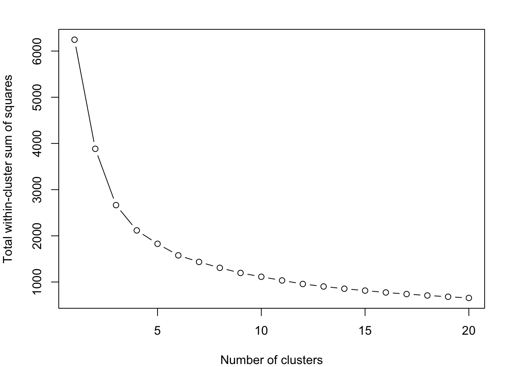

There is not a clear elbow shape here, implying that the ideal number of clusters is not clear-cut (with regards to the reduction in the total within cluster sum of the squares with increasing numbers of clusters). The reduction in total within cluster sum of squares does not seem to be as large with cluster sizes greater than 4, so that might be a good number of clusters for this dataset.

Anyway, let's try another method to identify an appropriate cluster size. The NbClust package has a useful function (`NbClust`) for determining the optimal number of clusters. It assesses the optimal cluster choice using the results of 30 different indices. I'm going to use the `index = "all"` argument which uses 26 of the 30 indices and is less computationally expensive than running the full set. (although it is still quite slow to run with over 2000 observations...). I'll try cluster sizes between 2 and 15.

``` r
par(mar = c(4,4,3,1))
nb_clusters <- NbClust(imdb_clean_scale[,2:4], min.nc = 2, max.nc = 15, method = "kmeans", distance = "euclidean", index = "all")
```

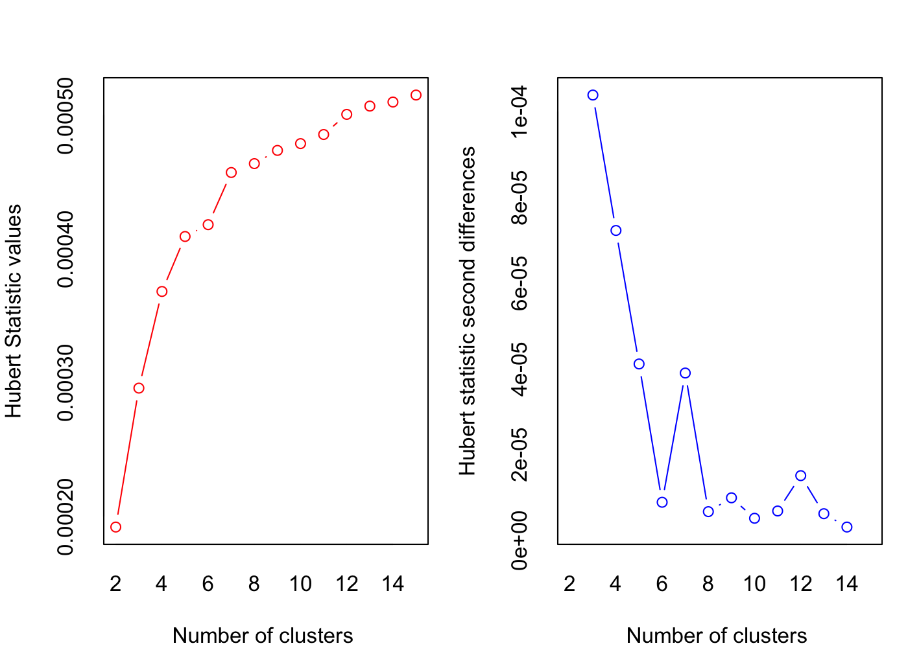

    ## *** : The Hubert index is a graphical method of determining the number of clusters.
    ##                 In the plot of Hubert index, we seek a significant knee that corresponds to a 
    ##                 significant increase of the value of the measure i.e the significant peak in Hubert
    ##                 index second differences plot. 
    ## 

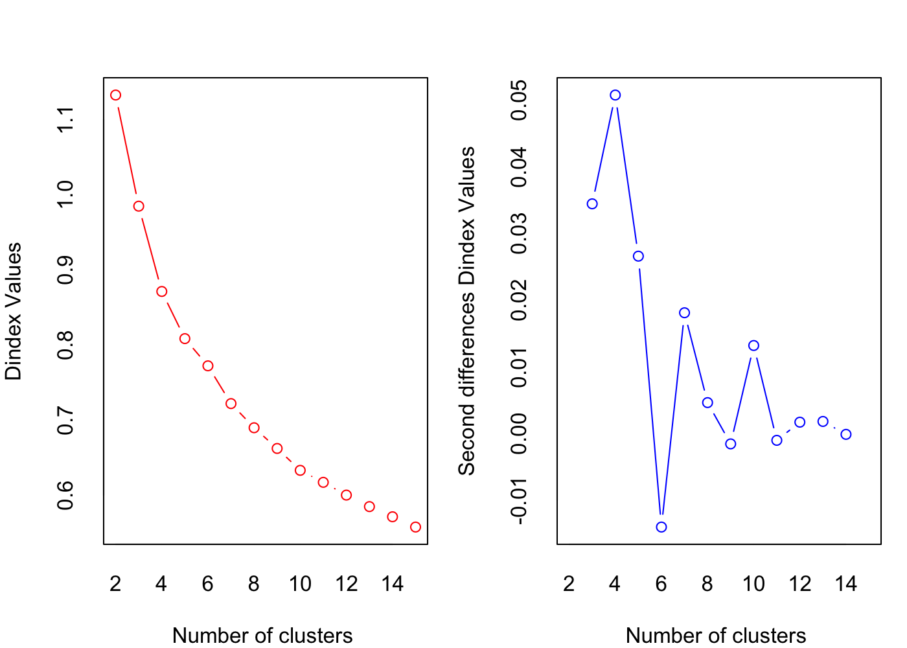

    ## *** : The D index is a graphical method of determining the number of clusters. 
    ##                 In the plot of D index, we seek a significant knee (the significant peak in Dindex
    ##                 second differences plot) that corresponds to a significant increase of the value of
    ##                 the measure. 
    ##  
    ## ******************************************************************* 
    ## * Among all indices:                                                
    ## * 2 proposed 2 as the best number of clusters 
    ## * 13 proposed 3 as the best number of clusters 
    ## * 2 proposed 4 as the best number of clusters 
    ## * 1 proposed 7 as the best number of clusters 
    ## * 1 proposed 10 as the best number of clusters 
    ## * 1 proposed 12 as the best number of clusters 
    ## * 1 proposed 13 as the best number of clusters 
    ## * 1 proposed 14 as the best number of clusters 
    ## * 1 proposed 15 as the best number of clusters 
    ## 
    ##                    ***** Conclusion *****                            
    ##  
    ## * According to the majority rule, the best number of clusters is  3 
    ##  
    ##  
    ## *******************************************************************

The results of this analysis seem to strongly support using 3 clusters. Let's try re-running the k-means clustering analysis twice, with 3 and 4 (the number of clusters the elbow method seemed to support) clusters, then plot the data and the clusters.

``` r
set.seed(12)
par(mfrow = c(1,1))
km_3 <- kmeans(imdb_clean_scale[,2:4], centers = 3, nstart = 50)
km_4 <- kmeans(imdb_clean_scale[,2:4], centers = 4, nstart = 50)
scatterplot3d(imdb_clean$rating, imdb_clean$metascore, imdb_clean$box_office, 
              pch = 20, color = fig_cols[km_3$cluster], cex.symbols = 0.6, cex.lab = 0.8,
              main = "K-means clustering with k = 3 (data untransformed but scaled)",
              xlab = "IMDB user rating",
              ylab = "Metascore",
              zlab = "Box office takings ($Million)")
```

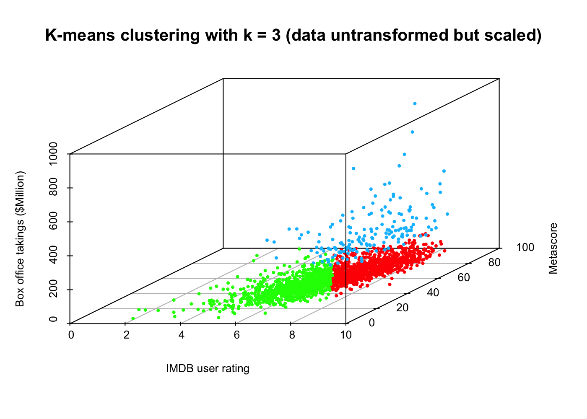

``` r
scatterplot3d(imdb_clean$rating, imdb_clean$metascore, imdb_clean$box_office, 
              pch = 20, color = fig_cols[km_4$cluster], cex.symbols = 0.6, cex.lab = 0.8,
              main = "K-means clustering with k = 4 (data untransformed but scaled)",
              xlab = "IMDB user rating",
              ylab = "Metascore",
              zlab = "Box office takings ($Million)")
```

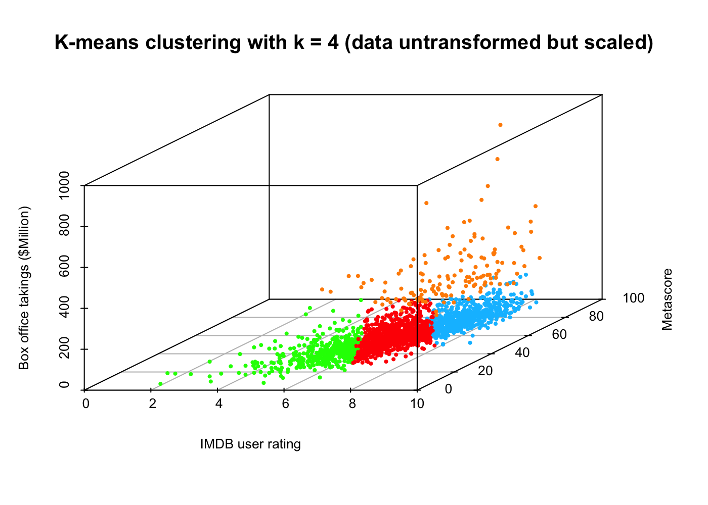

Both analyses seem to unite all the highest grossing films, and then divide the remaining films up based on their rating and metascore. However, all of the clusters still contain a lot of films, which means the list of most successful films is still going to be very large. As I am trying to identify the best and worst films from a sample size of over 2000, with 3 - 4 clusters each cluster will (on average) contain at least 500 films (although the cluster sizes do not have to be anywhere near equal).

This dataset does not seem to contain natural clusters (i.e. they are quite arbitrary) so a 'true' number of clusters is not obtainable. As clustering is an unsupervised method, often carried out to explore patterns in data, there is not necessarily a 'right' number of clusters. The 'optimum' number of clusters identified by the elbow method and the `NbClust` function does not seem to have given me a number of clusters which helps me to answer my question: finding out what are the most and least successful films. Therefore, I am going to elect to try a larger number of clusters. Let's try doubling the number of clusters to 8.

``` r
set.seed(12)
km_8 <- kmeans(imdb_clean_scale[,2:4], centers = 8, nstart = 50, iter.max = 20)
scatterplot3d(imdb_clean$rating, imdb_clean$metascore, imdb_clean$box_office, 
              pch = 20, color = fig_cols[km_8$cluster], cex.symbols = 0.6, cex.lab = 0.8,
              main = "K-means clustering with k = 8 (data untransformed but scaled)",
              xlab = "IMDB user rating",
              ylab = "Metascore",
              zlab = "Box office takings ($Million)")
```


This looks much more helpful in answering my question. I'm going to have a look at some of the different clusters to see what characterises them. I'll do this by making a grouped barplot that for each cluster shows the centre of the cluster for each variable (i.e. the coordinates of the centre of the cluster in the feature space). Also, for each cluster I'll calculate the mean trait value across all three variables to help me identify the clusters that contain the best/worst films overall.

``` r
centres <- melt(km_8$centers)
ggplot(data = centres, aes(x = Var1, y = value)) +
  geom_bar(aes(fill = Var2), stat = "identity", position = position_dodge(0.9)) +
  scale_x_continuous(name = "Cluster number", breaks = seq(1,10,1)) +
  scale_y_continuous(name = "Scaled values", breaks = seq(-2.5,5,1)) +
  scale_fill_discrete(name = "Variable") +
  ggtitle("Characteristics of each cluster for k-means clustering with k = 8 \n(scaled data)") +
  theme(panel.background = NULL, plot.title = element_text(hjust = 0.5))
```


``` r
sapply(1:nrow(km_8$centers), function(x) mean(unlist(imdb_clean_scale[km_8$cluster == x,2:4])))
```

    ## [1]  0.3281926 -0.2529707  0.1177120 -1.2186003 -0.5816219  1.2651615  0.6049936  2.1108486

This tells me a lot about the characteristics of the different clusters. Let's look through some of them:

-   Cluster 8 contains 46 films that were generally well rated by critics and fans, however, their most common feature is that they made lots of money.
    -   Fan ratings between 6 and 9, with an average of 7.45.
    -   Metascore between 32 and 94, although average is 68.87.
    -   Box office takings between $291.1 million and $ 936.7 million.

``` r
imdb_clean[km_8$cluster == 8,]
```

    ##                                                   title rating metascore box_office
    ## 3                                       The Dark Knight    9.0        82     534.86
    ## 17                                The Dark Knight Rises    8.4        78     448.14
    ## 26                                          Toy Story 3    8.3        92     415.00
    ## 41                                           Inside Out    8.2        94     356.46
    ## 64                              Guardians of the Galaxy    8.1        76     333.18
    ## 65                                    Avengers Assemble    8.1        69     623.36
    ## 71         Harry Potter and the Deathly Hallows: Part 2    8.1        87     381.01
    ## 107                                            Deadpool    8.0        65     363.07
    ## 108                                         Zootropolis    8.0        78     341.27
    ## 110          Star Wars: Episode VII - The Force Awakens    8.0        81     936.66
    ## 136                                      Thor: Ragnarok    7.9        74     315.06
    ## 137                                            Iron Man    7.9        79     318.41
    ## 142                   The Hobbit: An Unexpected Journey    7.9        58     303.00
    ## 166                          Captain America: Civil War    7.8        75     408.08
    ## 167                                              Avatar    7.8        83     760.51
    ## 169                                           Rogue One    7.8        65     532.18
    ## 190                                             Skyfall    7.8        81     304.36
    ## 232                     Guardians of the Galaxy: Vol. 2    7.7        67     389.81
    ## 243        Harry Potter and the Deathly Hallows: Part 1    7.7        65     295.98
    ## 292              Harry Potter and the Half-Blood Prince    7.6        78     301.96
    ## 354                                        Wonder Woman    7.5        76     412.56
    ## 355                               Spider-Man Homecoming    7.5        73     334.20
    ## 356                                                  It    7.5        69     327.48
    ## 362                                              Frozen    7.5        74     400.74
    ## 371                     The Hunger Games: Catching Fire    7.5        76     424.67
    ## 419             Star Wars: Episode VIII - The Last Jedi    7.4        85     620.03
    ## 421                             Avengers: Age of Ultron    7.4        66     459.01
    ## 462                                     Despicable Me 2    7.4        62     368.06
    ## 508                                Beauty and the Beast    7.3        65     504.01
    ## 520                                        Finding Dory    7.3        77     486.30
    ## 522                                     American Sniper    7.3        72     350.13
    ## 609                                      Iron Man Three    7.2        62     409.01
    ## 610                                    The Hunger Games    7.2        68     408.01
    ## 614                                    Fast & Furious 7    7.2        67     353.01
    ## 714                                        Man of Steel    7.1        55     291.05
    ## 826                      Jumanji: Welcome to the Jungle    7.0        58     402.09
    ## 831                                      Jurassic World    7.0        59     652.27
    ## 834                                          Iron Man 2    7.0        57     312.43
    ## 1149              The Hunger Games: Mockingjay - Part 1    6.7        64     337.14
    ## 1251                 Batman v Superman: Dawn of Justice    6.6        44     330.36
    ## 1368                            The Secret Life of Pets    6.5        61     368.38
    ## 1376                                Alice in Wonderland    6.5        53     334.19
    ## 1490                                            Minions    6.4        56     336.05
    ## 1622                     Transformers: Dark of the Moon    6.3        42     352.39
    ## 1742 Indiana Jones and the Kingdom of the Crystal Skull    6.2        65     317.10
    ## 1964                Transformers: Revenge of the Fallen    6.0        35     402.11

``` r
summary(imdb_clean[km_8$cluster == 8,])
```

    ##     title               rating        metascore       box_office   
    ##  Length:46          Min.   :6.000   Min.   :35.00   Min.   :291.1  
    ##  Class :character   1st Qu.:7.125   1st Qu.:62.00   1st Qu.:333.4  
    ##  Mode  :character   Median :7.500   Median :68.50   Median :368.2  
    ##                     Mean   :7.448   Mean   :68.87   Mean   :412.1  
    ##                     3rd Qu.:7.900   3rd Qu.:77.75   3rd Qu.:422.3  
    ##                     Max.   :9.000   Max.   :94.00   Max.   :936.7

-   Cluster 4 contains films that well poorly rated by fans and critics, and generally did not really make much money. Overall there are 186 films in this category, but a sample of them are shown below.
    -   Fan ratings between 1.5 and 5.6.
    -   Metascore between 7 and 57.
    -   Box office takings between $0 million and $219.61 million, although the average is $36.15 million.

``` r
head(imdb_clean[km_8$cluster == 4,], n = 10)
```

    ##                  title rating metascore box_office
    ## 2268      Mother's Day    5.6        18      32.46
    ## 2331         Mortdecai    5.5        27       7.61
    ## 2332   Couples Retreat    5.5        23     109.21
    ## 2335   Moms' Night Out    5.5        25      10.43
    ## 2336    Little Fockers    5.5        27     148.38
    ## 2337        Bride Wars    5.5        24      58.72
    ## 2339 The Bounty Hunter    5.5        22      67.06
    ## 2341        The Smurfs    5.5        30     142.61
    ## 2363          Geostorm    5.4        21      33.70
    ## 2364     Gods of Egypt    5.4        25      31.15

``` r
tail(imdb_clean[km_8$cluster == 4,], n = 10)
```

    ##                                title rating metascore box_office
    ## 2674                   Jack and Jill    3.4        23      74.16
    ## 2675                   Vampires Suck    3.4        18      36.66
    ## 2677 Bucky Larson: Born to Be a Star    3.3         9       2.33
    ## 2678                 The Emoji Movie    3.1        12      86.09
    ## 2679                     Left Behind    3.1        12      14.00
    ## 2682               Meet the Spartans    2.7         9      38.23
    ## 2683            Dragonball Evolution    2.6        45       9.35
    ## 2686                  Disaster Movie    1.9        15      14.19
    ## 2687         The Hottie & the Nottie    1.9         7       0.03
    ## 2691                Saving Christmas    1.5        18       2.78

``` r
summary(imdb_clean[km_8$cluster == 4,])
```

    ##     title               rating        metascore       box_office    
    ##  Length:186         Min.   :1.500   Min.   : 7.00   Min.   :  0.00  
    ##  Class :character   1st Qu.:4.400   1st Qu.:23.00   1st Qu.:  9.78  
    ##  Mode  :character   Median :4.900   Median :30.00   Median : 26.17  
    ##                     Mean   :4.735   Mean   :29.72   Mean   : 36.15  
    ##                     3rd Qu.:5.200   3rd Qu.:36.00   3rd Qu.: 47.42  
    ##                     Max.   :5.600   Max.   :57.00   Max.   :219.61

**However**, If we look back at the grouped bar chart the positive bars of the cluster with the most successful films (Cluster 2), the bar for the `box_office` variable extends much further than any other bar. Also, the negative `box_office` bars are extremely short. This is likely because of the positive skew in the `box_office` variable. Therefore, it is likely that the box office takings, the extreme outliers to be more specific, are still having a larger impact on the clustering of the data than the other two variables. As I am looking at what films are successful all round, transforming the data might be sensible in helping to equalise the impact of all variables!

### Transformed data

Let's start by taking a look at the distributions of the three unscaled variables.

``` r
par(mfrow = c(1,3), mar = c(4,4,2,1))
hist(imdb_clean$rating, col = "red", 
     xlab = "IMDB user rating", breaks = 15,
     main = "")
hist(imdb_clean$metascore, col = "red", breaks = 15,
     xlab = "Metascore", 
     main = "")
hist(imdb_clean$box_office, col = "red", 
     xlab = "Box office takings ($Million)", breaks = 15,
     main = "")
```

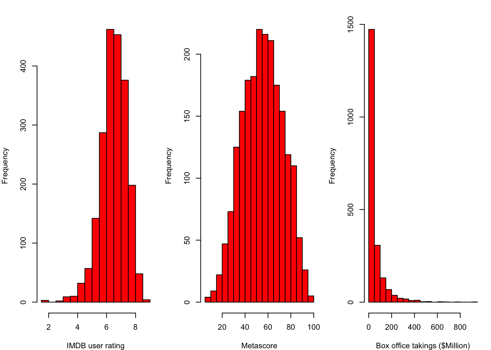

The `metascore` variable is fairly normally distributed, the `rating` is slightly skewed, and the `box_office` variable is completely skewed by the relatively few films that make lots of money. I'm going to transform the `rating` and `box_office` variables using Box-Cox transformations, implemented by the `boxcoxfit` function in the GeoR package. Box-Cox transformations only work with positive values (&gt; 0), so the zero values in the `box_office` variable are slightly problematic. What I am going to do is add a small constant to the data so that I can use this method. After 0 the next smallest value is 0.01, so by adding 0.001 to each observation it will not affect the initial distribution, but allow the data to be transformed. In reality most of the films probably (hopefully, for the directors' sake) did not make $0 at the box office, but the data is rounded to the nearest $10,000, so films with $0 takings in dataset could have generated ≥$0 and &lt;$5000.

``` r
imdb_clean_transformed <- imdb_clean
a <- boxcoxfit(imdb_clean$rating)$lambda
imdb_clean_transformed[,2] <- scale(imdb_clean$rating^(a))
imdb_clean_transformed[,3] <- scale(imdb_clean$metascore)
b <- boxcoxfit((imdb_clean$box_office + 0.001))$lambda
imdb_clean_transformed[,4] <- scale((imdb_clean$box_office + 0.001)^(b))
hist(imdb_clean_transformed$rating, col = "red", breaks = 15,
     xlab = bquote("IMDB user rating"^.(round(a,3))), 
     main = "")
hist(imdb_clean_transformed$metascore, col = "red", breaks = 15,
     xlab = "Metascore", 
     main = "")
hist(imdb_clean_transformed$box_office, col = "red", breaks = 15,
     xlab = bquote("Box office takings ($Million)"^.(round(0.172,3))), 
     main = "")
```

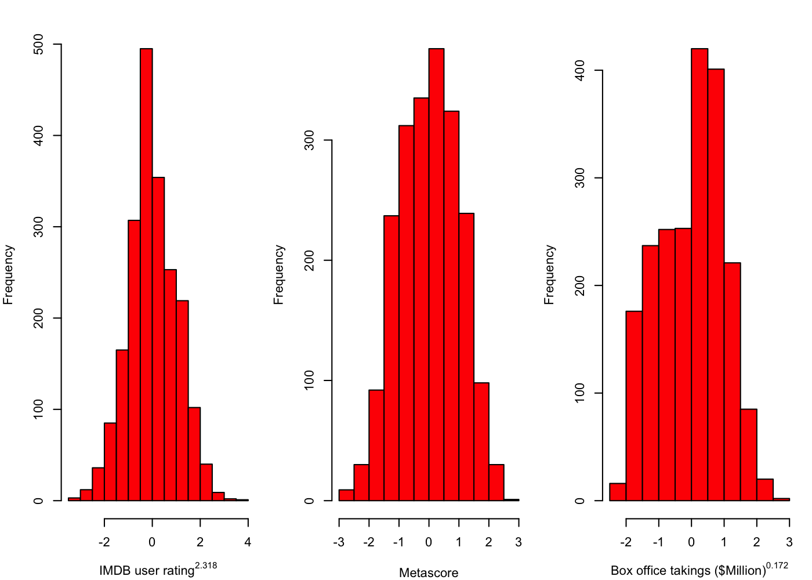

The distributions of the data now look much more normal, although the `box_office` data is still not perfect. Now the data has been transformed and scaled let's retry the k-means analysis with 8 clusters (as I did with the untransformed data). I'll then plot the clusters onto both of the transformed and untransformed datasets, and then look at the characteristics of the clusters.

``` r
par(mfrow = c(1,1))
set.seed(12)
km_8_trans <- kmeans(imdb_clean_transformed[,2:4], centers = 8, nstart = 50, iter.max = 20)
scatterplot3d(imdb_clean_transformed$rating, imdb_clean_transformed$metascore, imdb_clean_transformed$box_office, 
              pch = 20, color = fig_cols[km_8_trans$cluster], cex.symbols = 0.6, cex.lab = 0.8,
              main = "K-means clustering with k = 8 (data transformed and scaled)",
              xlab = expression("IMDB user rating"^2.322),
              ylab = "Metascore",
              zlab = bquote("Box office takings ($Million)"^.(round(0.172,3))))
```


``` r
scatterplot3d(imdb_clean$rating, imdb_clean$metascore, imdb_clean$box_office, 
              pch = 20, color = fig_cols[km_8_trans$cluster], cex.symbols = 0.6, cex.lab = 0.8,
              main = "K-means clustering with k = 8 (data transformed and scaled)",
              xlab = "IMDB user rating",
              ylab = "Metascore",
              zlab = "Box office takings ($Million)")
```


``` r
centres_trans <- melt(km_8_trans$centers)
ggplot(data = centres_trans, aes(x = Var1, y = value)) +
  geom_bar(aes(fill = Var2), stat = "identity", position = position_dodge(0.9)) +
  scale_x_continuous(name = "Cluster number", breaks = seq(1,10,1)) +
  scale_y_continuous(name = "Scaled values", breaks = seq(-2,2,0.5)) +
  scale_fill_discrete(name = "Variable") +
  ggtitle("Characteristics of each cluster for k-means clustering with k = 8 \n(transformed and scaled data)") +
  theme(panel.background = NULL, plot.title = element_text(hjust = 0.5))
```

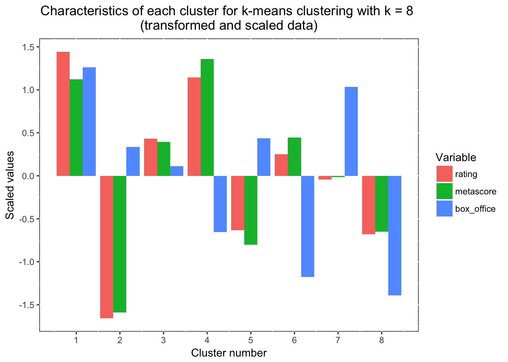

``` r
sapply(1:nrow(km_8_trans$centers), function(x) mean(unlist(imdb_clean_transformed[km_8_trans$cluster == x,2:4])))
```

    ## [1]  1.2757522 -0.9694141  0.3131974  0.6165680 -0.3333758 -0.1602008  0.3255666 -0.9053209

Now the arrangement of the clusters is quite different to when the untransformed data was used. In the grouped barplot the heights of the columns are much more balanced between variables; on the untransformed dataset the `box_office` variable was either very large or small.

-   Cluster 1 appears to contain the most successful films. It contains a lot more films than the cluster of the most successful films from the analysis of the untransformed data (197 vs 46).
    -   User rating between 7 and 9.
    -   Metascore between 48 and 96, with an average of 75.52.
    -   Box office takings between $13.18 million and $936.66 million, with an average of $175.95 million.

``` r
head(imdb_clean[km_8_trans$cluster == 1,], n = 10)
```

    ##                    title rating metascore box_office
    ## 3        The Dark Knight    9.0        82     534.86
    ## 6              Inception    8.8        74     292.58
    ## 9           Interstellar    8.6        74     188.02
    ## 13                  Coco    8.5        81     209.43
    ## 15           Untouchable    8.5        57      13.18
    ## 16      Django Unchained    8.4        81     162.81
    ## 17 The Dark Knight Rises    8.4        78     448.14
    ## 19                WALL·E    8.4        95     223.81
    ## 24  Inglourious Basterds    8.3        69     120.54
    ## 25                    Up    8.3        88     293.00

``` r
tail(imdb_clean[km_8_trans$cluster == 1,], n = 10)
```

    ##                           title rating metascore box_office
    ## 713            Star Trek Beyond    7.1        68     158.85
    ## 718   The Princess and the Frog    7.1        73     104.40
    ## 721               Don't Breathe    7.1        71      89.22
    ## 734                       Brave    7.1        69     237.28
    ## 774                 The Muppets    7.1        75      88.63
    ## 839                         Spy    7.0        75     110.83
    ## 841              Tropic Thunder    7.0        71     110.52
    ## 852 Hellboy II: The Golden Army    7.0        78      75.75
    ## 857              22 Jump Street    7.0        71     191.72
    ## 869                     Super 8    7.0        72     127.00

``` r
summary(imdb_clean[km_8_trans$cluster == 1,])
```

    ##     title               rating        metascore       box_office    
    ##  Length:197         Min.   :7.000   Min.   :48.00   Min.   : 13.18  
    ##  Class :character   1st Qu.:7.400   1st Qu.:69.00   1st Qu.: 75.59  
    ##  Mode  :character   Median :7.700   Median :75.00   Median :136.03  
    ##                     Mean   :7.696   Mean   :75.52   Mean   :175.95  
    ##                     3rd Qu.:7.900   3rd Qu.:82.00   3rd Qu.:232.64  
    ##                     Max.   :9.000   Max.   :96.00   Max.   :936.66

Two clusters contain the least successful films (clusters 2 and 8).

-   Cluster 2 has 195 films which were very badly rated but generally did okay at the box office.
    -   Rating between 1.5 and 6.1.
    -   Metascore between 7 and 50.
    -   Box office takings between $0.03 million and $296.62 million, with an average of $40.67 million.

``` r
summary(imdb_clean[km_8_trans$cluster == 2,])
```

    ##     title               rating        metascore       box_office    
    ##  Length:195         Min.   :1.500   Min.   : 7.00   Min.   :  0.03  
    ##  Class :character   1st Qu.:4.500   1st Qu.:23.00   1st Qu.: 16.38  
    ##  Mode  :character   Median :5.100   Median :29.00   Median : 28.85  
    ##                     Mean   :4.871   Mean   :28.24   Mean   : 40.67  
    ##                     3rd Qu.:5.400   3rd Qu.:33.50   3rd Qu.: 51.88  
    ##                     Max.   :6.100   Max.   :50.00   Max.   :296.62

-   Cluster 8 contains 232 films that were badly (although not very badly) rated but performed terribly at the box office.
    -   Rating between 4.2 and 7.4, with an average of 5.97.
    -   Metascore between 14 and 66, with an average of 44.62.
    -   Box office takings between $0 million and $4.72 million.

``` r
summary(imdb_clean[km_8_trans$cluster == 8,])
```

    ##     title               rating        metascore       box_office    
    ##  Length:232         Min.   :4.200   Min.   :14.00   Min.   :0.0000  
    ##  Class :character   1st Qu.:5.700   1st Qu.:38.00   1st Qu.:0.0300  
    ##  Mode  :character   Median :6.100   Median :45.00   Median :0.1200  
    ##                     Mean   :5.972   Mean   :44.62   Mean   :0.6040  
    ##                     3rd Qu.:6.400   3rd Qu.:51.00   3rd Qu.:0.5925  
    ##                     Max.   :7.400   Max.   :66.00   Max.   :4.7200

### Summary

While using the untransformed data yielded nice small clusters of successful films, the positive skew in the `box_office` variable was clearly a major driver in this result.

The analysis with the transformed data appeared to be more balanced, as the effect of the `box_office` variable was reduced. However, this method did not yield clusters that were as helpful in trying to understand the best and worst films (i.e. no clear top/bottom clusters). At this stage I think it is worth noting that getting clusters that select the best and worst films is not necessarily guaranteed, as the the clustering analysis could find more optimal ways to group the data -- and the algorithm does not care about my project goals of finding the best and worst films!

Hierarchial clustering
----------------------

Earlier on, I found that the skewed distribution of the box\_office variable was big impacting on the clustering of the data. Therefore, I am going to continue using the transformed dataset from the previous section.

Now let's try carrying out the clustering analysis again using hierarchial clustering. With hierarchial clustering there are a number of parameters that can be changed (e.g. linkage method, where to cut the dendrogram, distance method). I'm going to start by using three commonly used linkage methods:

-   Complete
-   Average
-   Ward

``` r
hier_comp <- hclust(dist(imdb_clean_transformed[,2:4]), method = "complete")
hier_avg <- hclust(dist(imdb_clean_transformed[,2:4]), method = "average")
hier_ward <- hclust(dist(imdb_clean_transformed[,2:4]), method = "ward.D")
par(mfrow = c(2,2), mar = c(1,4,2,1))
plot(hier_comp, lwd = 0.5, labels = FALSE, main = "Complete linkage", xlab = "", sub = "")
plot(hier_avg, lwd = 0.5, labels = FALSE, main = "Average linkage", xlab = "", sub = "")
plot(hier_ward, lwd = 0.5, labels = FALSE, main = "Ward linkage", xlab = "", sub = "")
```

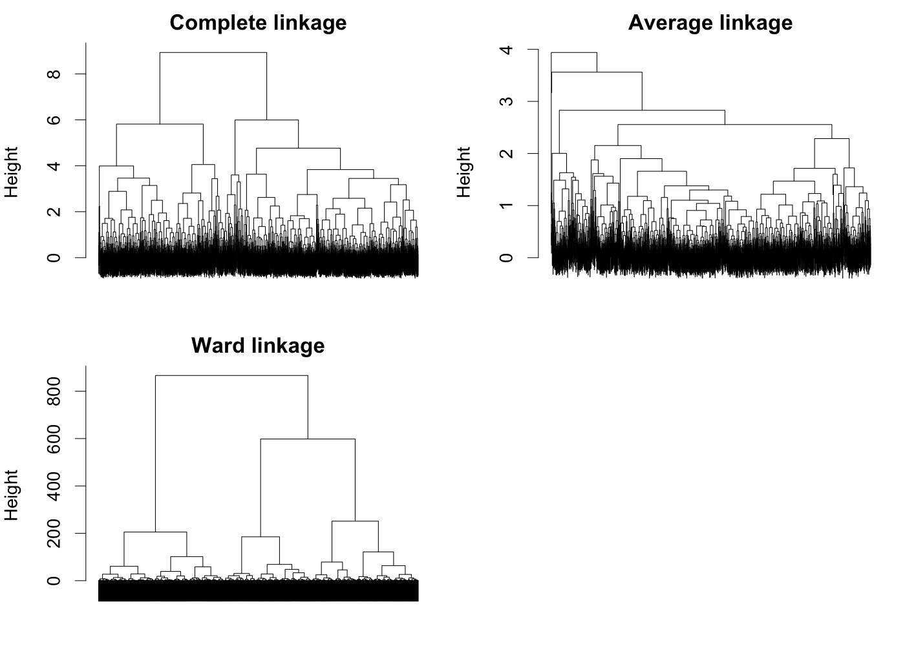

You can clearly see that each linkage method produces quite a different dendrogram, and arrangement of clusters. Complete and average linkage will probably produce clusters that are uneven in size, whereas Ward linkage looks like it will produce clusters that are quite even in size.

### Complete linkage

To try and work out the optimum number of clusters I am going to use the `NbClust` function again. The 'best' number of clusters was not too helpful when using k-means clustering, but let's see if it is any more helpful here.

``` r
par(mar = c(4,4,3,1))
complete_nbclust <- NbClust(imdb_clean_transformed[,2:4], min.nc = 2, max.nc = 15, method = "complete",
                            distance = "euclidean", index = "all")
```

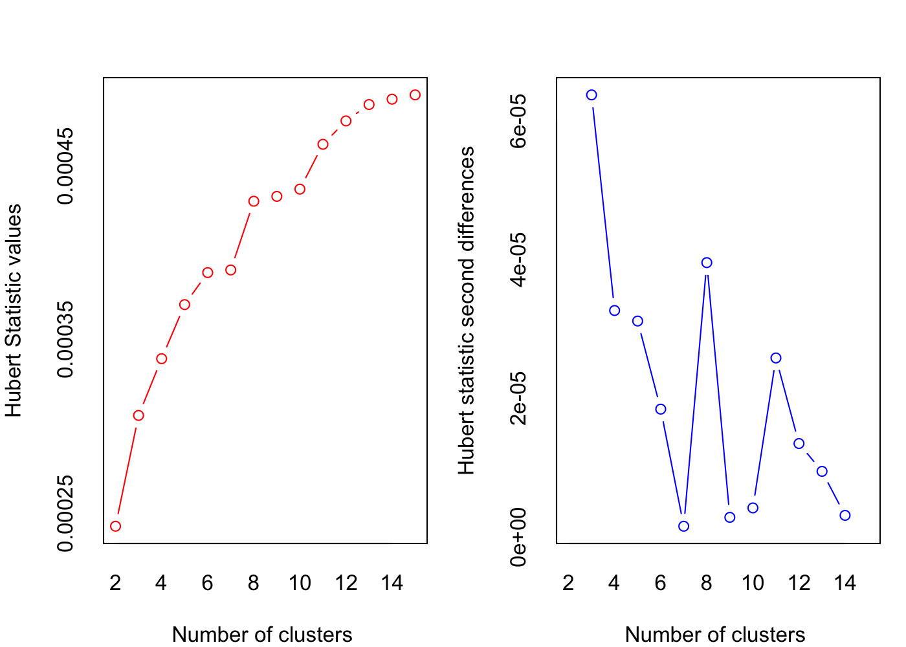

    ## *** : The Hubert index is a graphical method of determining the number of clusters.
    ##                 In the plot of Hubert index, we seek a significant knee that corresponds to a 
    ##                 significant increase of the value of the measure i.e the significant peak in Hubert
    ##                 index second differences plot. 
    ## 

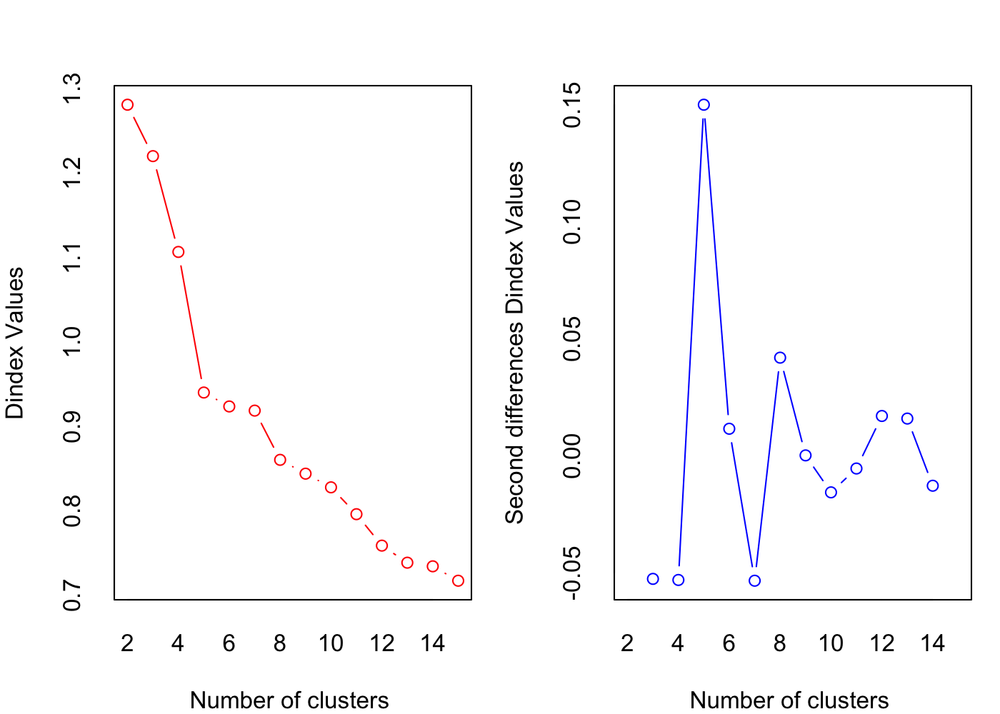

    ## *** : The D index is a graphical method of determining the number of clusters. 
    ##                 In the plot of D index, we seek a significant knee (the significant peak in Dindex
    ##                 second differences plot) that corresponds to a significant increase of the value of
    ##                 the measure. 
    ##  
    ## ******************************************************************* 
    ## * Among all indices:                                                
    ## * 7 proposed 2 as the best number of clusters 
    ## * 3 proposed 3 as the best number of clusters 
    ## * 11 proposed 5 as the best number of clusters 
    ## * 1 proposed 14 as the best number of clusters 
    ## * 1 proposed 15 as the best number of clusters 
    ## 
    ##                    ***** Conclusion *****                            
    ##  
    ## * According to the majority rule, the best number of clusters is  5 
    ##  
    ##  
    ## *******************************************************************

This time the `NbClust` functions suggests that the optimum number of clusters is 5.

``` r
par(mfrow = c(1,1))
hier_comp_cut <- cutree(hier_comp, 5)
scatterplot3d(imdb_clean_transformed$rating, imdb_clean_transformed$metascore, imdb_clean_transformed$box_office,
              pch = 20, color = fig_cols[hier_comp_cut], cex.symbols = 0.6, cex.lab = 0.8,
              main = paste("Hierarchial clustering (complete linkage) with", max(hier_comp_cut), "clusters \n(data transformed and scaled)", sep = " "),
              xlab = bquote("IMDB user rating"^.(round(a,3))),
              ylab = "Metascore",
              zlab = bquote("Box office takings ($Million)"^.(round(b,3))))
```

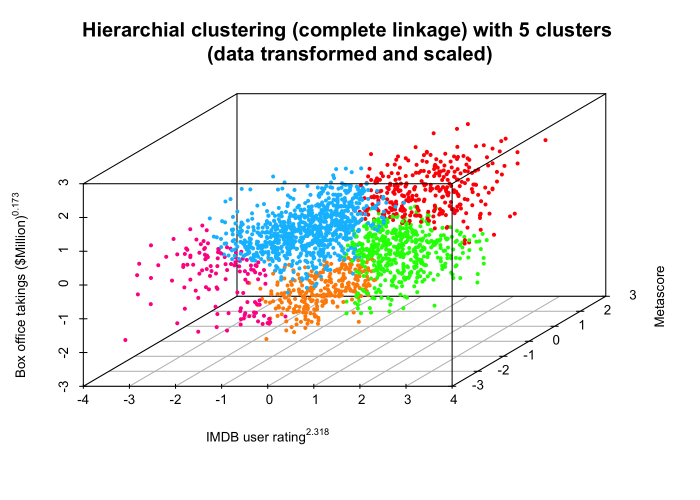

As with the earlier analyses small numbers of clusters do not seem to provide a scheme that adequately helps answer my question (i.e. each cluster covers too much of the feature space). Therefore, let's go back to using 8 clusters again as this number seemed to give adequate results before -- and it will allow me to compare the performance of different methods.

``` r
hier_comp_cut <- cutree(hier_comp, 8)
scatterplot3d(imdb_clean_transformed$rating, imdb_clean_transformed$metascore, imdb_clean_transformed$box_office,
              pch = 20, color = fig_cols[hier_comp_cut], cex.symbols = 0.6, cex.lab = 0.8,
              main = paste("Hierarchial clustering (complete linkage) with", max(hier_comp_cut), "clusters \n(data transformed and scaled)", sep = " "),
              xlab = bquote("IMDB user rating"^.(round(a,3))),
              ylab = "Metascore",
              zlab = bquote("Box office takings ($Million)"^.(round(b,3))))
```

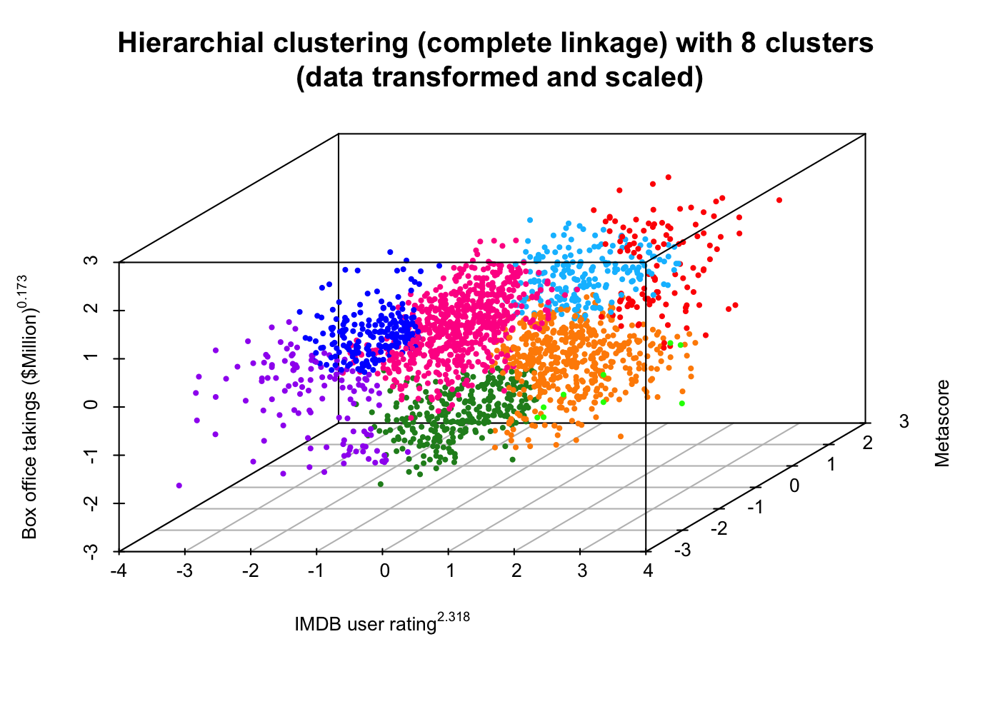

This looks promising, so I am going to take a look at the characteristics of the different clusters.

``` r
mean_values <- matrix(unlist(lapply(1:max(hier_comp_cut), function(x) colMeans(imdb_clean_transformed[hier_comp_cut == x,2:4]))), ncol = 3, byrow = TRUE)
colnames(mean_values) <- colnames(imdb_clean_transformed[,2:4])
mean_values<- melt(mean_values)
ggplot(data = mean_values, aes(x = Var1, y = value)) +
  geom_bar(aes(fill = Var2), stat = "identity", position = position_dodge(0.9)) +
  scale_x_continuous(name = "Cluster number", breaks = seq(1, max(hier_comp_cut), 1)) +
  scale_y_continuous(name = "Transformed and scaled values", breaks = seq(-2.5,2,0.5)) +
  scale_fill_discrete(name = "Variables") +
  ggtitle(paste("Mean values of each cluster for hierarchial clustering with k =", max(hier_comp_cut), "\n(Complete linkage; transformed and scaled data)", sep = " ")) +
  theme(panel.background = NULL, plot.title = element_text(hjust = 0.5))
```

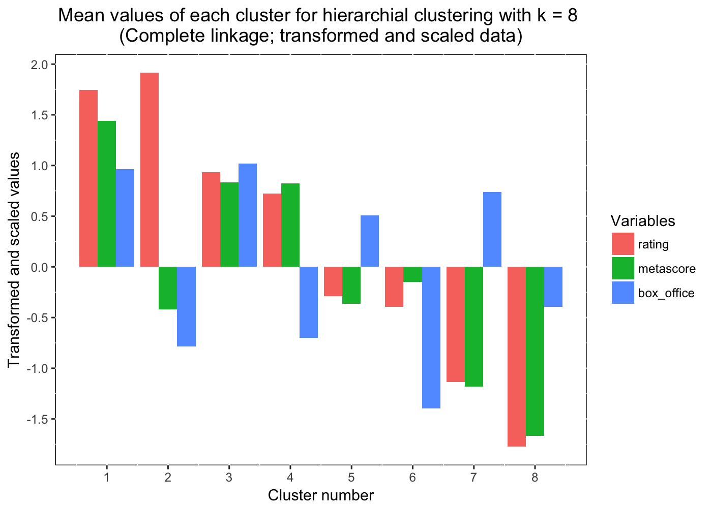

``` r
sapply(1:max(hier_comp_cut), function(x) mean(unlist(imdb_clean_transformed[hier_comp_cut == x,2:4])))
```

    ## [1]  1.38282773  0.23816384  0.92751562  0.28143836 -0.04988231 -0.64586832 -0.52732858 -1.27853285

This clustering method seems to do a good job at building clusters that are useful for answering my question. Cluster 1 contains films that are successful all round and cluster 8 contains films that seem to be the most unsuccessful.

-   Cluster 1 contains 112 films that, generally, are highly rated by fans and critics, and took lots of money at the box office.
    -   User rating between 7.3 and 9.
    -   Metascore between 65 and 100, with an average of 81.11.
    -   Box office takings between $3.11 million and $936.66 million, with an average of $165.61 million.

``` r
summary(imdb_clean[hier_comp_cut == 1,])
```

    ##     title               rating        metascore        box_office    
    ##  Length:112         Min.   :7.300   Min.   : 65.00   Min.   :  3.11  
    ##  Class :character   1st Qu.:7.700   1st Qu.: 74.00   1st Qu.: 20.76  
    ##  Mode  :character   Median :7.900   Median : 80.00   Median : 55.42  
    ##                     Mean   :7.904   Mean   : 81.11   Mean   :165.61  
    ##                     3rd Qu.:8.100   3rd Qu.: 88.00   3rd Qu.:262.30  
    ##                     Max.   :9.000   Max.   :100.00   Max.   :936.66

``` r
head(imdb_clean[hier_comp_cut == 1,], n = 10)
```

    ##                    title rating metascore box_office
    ## 3        The Dark Knight    9.0        82     534.86
    ## 6              Inception    8.8        74     292.58
    ## 9           Interstellar    8.6        74     188.02
    ## 13                  Coco    8.5        81     209.43
    ## 14              Whiplash    8.5        88      13.09
    ## 16      Django Unchained    8.4        81     162.81
    ## 17 The Dark Knight Rises    8.4        78     448.14
    ## 18        Kimi no na wa.    8.4        79       5.02
    ## 19                WALL·E    8.4        95     223.81
    ## 25                    Up    8.3        88     293.00

``` r
tail(imdb_clean[hier_comp_cut == 1,], n = 10)
```

    ##                                       title rating metascore box_office
    ## 321                                Arrietty    7.6        80      19.20
    ## 354                            Wonder Woman    7.5        76     412.56
    ## 362                                  Frozen    7.5        74     400.74
    ## 371         The Hunger Games: Catching Fire    7.5        76     424.67
    ## 383                       Fruitvale Station    7.5        85      16.10
    ## 384                     Inside Llewyn Davis    7.5        93      13.24
    ## 387                             Still Alice    7.5        72      18.75
    ## 419 Star Wars: Episode VIII - The Last Jedi    7.4        85     620.03
    ## 424                               Moonlight    7.4        99      27.85
    ## 520                            Finding Dory    7.3        77     486.30

-   Cluster 8 contains 125 films that were rated poorly by fans and critics, and performed poorly at the box office.
    -   User ratings between 1.5 and 6.3, with an average of 4.7.
    -   Metascores between 7 and 45, with an average of 26.83.
    -   Box office takings between $0 million and $133.11 million, with average takings of $16.92 million.

``` r
summary(imdb_clean[hier_comp_cut == 8,])
```

    ##     title               rating      metascore       box_office    
    ##  Length:125         Min.   :1.5   Min.   : 7.00   Min.   :  0.00  
    ##  Class :character   1st Qu.:4.3   1st Qu.:22.00   1st Qu.:  0.38  
    ##  Mode  :character   Median :4.9   Median :27.00   Median : 10.14  
    ##                     Mean   :4.7   Mean   :26.83   Mean   : 16.92  
    ##                     3rd Qu.:5.3   3rd Qu.:33.00   3rd Qu.: 21.43  
    ##                     Max.   :6.3   Max.   :45.00   Max.   :133.11

``` r
head(imdb_clean[hier_comp_cut == 8,], n = 10)
```

    ##                     title rating metascore box_office
    ## 1640 I Spit on Your Grave    6.3        27       0.09
    ## 1971        Walk of Shame    6.0        25       0.04
    ## 2002         No One Lives    6.0        26       0.07
    ## 2013  Waiting for Forever    6.0        26       0.03
    ## 2068  Kill Me Three Times    5.9        30       0.02
    ## 2150           The Divide    5.8        28       0.02
    ## 2171   Echelon Conspiracy    5.8        26       0.50
    ## 2197           Regression    5.7        32       0.05
    ## 2198              Collide    5.7        33       2.28
    ## 2224      Meet the Blacks    5.7        26       9.09

``` r
tail(imdb_clean[hier_comp_cut == 8,], n = 10)
```

    ##                                title rating metascore box_office
    ## 2674                   Jack and Jill    3.4        23      74.16
    ## 2675                   Vampires Suck    3.4        18      36.66
    ## 2677 Bucky Larson: Born to Be a Star    3.3         9       2.33
    ## 2678                 The Emoji Movie    3.1        12      86.09
    ## 2679                     Left Behind    3.1        12      14.00
    ## 2682               Meet the Spartans    2.7         9      38.23
    ## 2683            Dragonball Evolution    2.6        45       9.35
    ## 2686                  Disaster Movie    1.9        15      14.19
    ## 2687         The Hottie & the Nottie    1.9         7       0.03
    ## 2691                Saving Christmas    1.5        18       2.78

### Average linkage

``` r
hier_avg_cut <- cutree(hier_avg, 8)
scatterplot3d(imdb_clean_transformed$rating, imdb_clean_transformed$metascore, imdb_clean_transformed$box_office,
              pch = 20, color = fig_cols[hier_avg_cut], cex.symbols = 0.6, cex.lab = 0.8,
              main = paste("Hierarchial clustering (average linkage) with", max(hier_avg_cut), "clusters \n(data transformed and scaled)", sep = " "),
              xlab = bquote("IMDB user rating"^.(round(a,3))),
              ylab = "Metascore",
              zlab = bquote("Box office takings ($Million)"^.(round(b,3))))
```

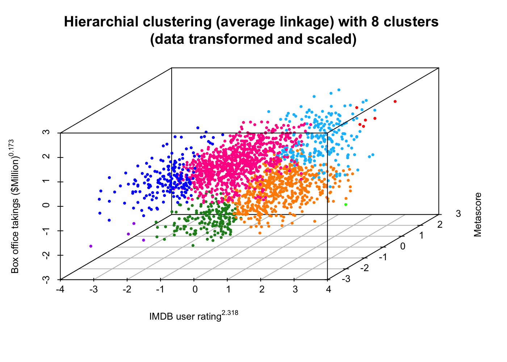

``` r
mean_values <- matrix(unlist(lapply(1:max(hier_avg_cut), function(x) colMeans(imdb_clean_transformed[hier_avg_cut == x,2:4]))), ncol = 3, byrow = TRUE)
colnames(mean_values) <- colnames(imdb_clean_transformed[,2:4])
mean_values<- melt(mean_values)
ggplot(data = mean_values, aes(x = Var1, y = value)) +
  geom_bar(aes(fill = Var2), stat = "identity", position = position_dodge(0.9)) +
  scale_x_continuous(name = "Cluster number", breaks = seq(1, max(hier_comp_cut), 1)) +
  scale_y_continuous(name = "Transformed and scaled values", breaks = seq(-2.5,2,0.5)) +
  scale_fill_discrete(name = "Variables") +
  ggtitle(paste("Mean values of each cluster for hierarchial clustering with k =", max(hier_avg_cut), "\n(Average linkage; transformed and scaled data)", sep = " ")) +
  theme(panel.background = NULL, plot.title = element_text(hjust = 0.5))
```

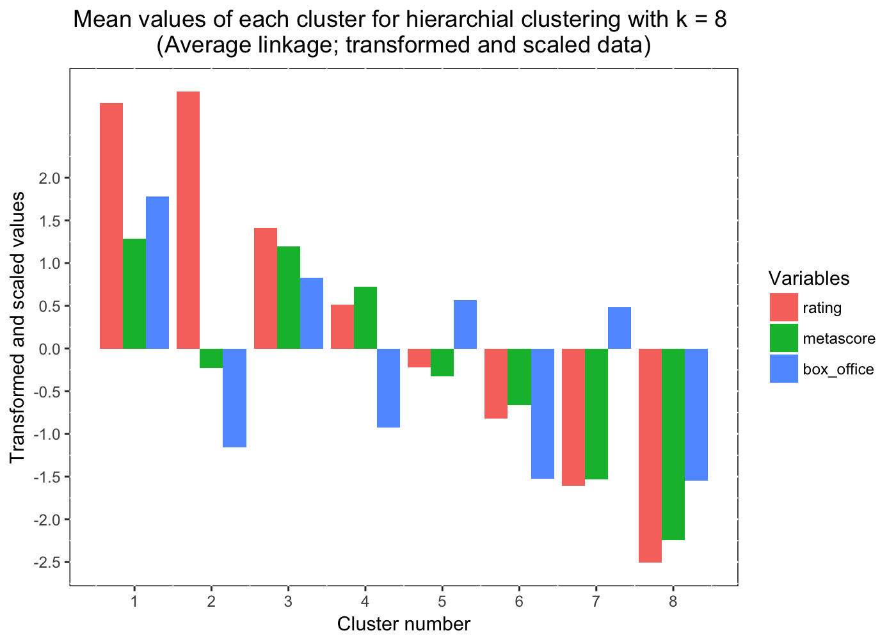

``` r
sapply(1:max(hier_avg_cut), function(x) mean(unlist(imdb_clean_transformed[hier_avg_cut == x,2:4])))
```

    ## [1]  1.977592208  0.540980829  1.144426632  0.104284432  0.006989265 -1.003945400 -0.885037611 -2.100173050

As with complete linkage, this hierarchial method seems to perform quite well.

-   Cluster 1 contains just 6 successful films.
    -   User ratings between 8.4 and 9.
    -   Metascores between 75 and 82.
    -   Box office takings between $162 million and $534.9 million.

``` r
summary(imdb_clean[hier_avg_cut == 1,])
```

    ##     title               rating        metascore       box_office   
    ##  Length:6           Min.   :8.400   Min.   :74.00   Min.   :162.8  
    ##  Class :character   1st Qu.:8.425   1st Qu.:75.00   1st Qu.:193.4  
    ##  Mode  :character   Median :8.550   Median :79.50   Median :251.0  
    ##                     Mean   :8.617   Mean   :78.33   Mean   :306.0  
    ##                     3rd Qu.:8.750   3rd Qu.:81.00   3rd Qu.:409.2  
    ##                     Max.   :9.000   Max.   :82.00   Max.   :534.9

``` r
imdb_clean[hier_avg_cut == 1,]
```

    ##                    title rating metascore box_office
    ## 3        The Dark Knight    9.0        82     534.86
    ## 6              Inception    8.8        74     292.58
    ## 9           Interstellar    8.6        74     188.02
    ## 13                  Coco    8.5        81     209.43
    ## 16      Django Unchained    8.4        81     162.81
    ## 17 The Dark Knight Rises    8.4        78     448.14

-   Cluster 8 contains just 4 unsuccessful films.
    -   User ratings between 1.9 and 4.5.
    -   Metascores between 7 and 24.
    -   Box office takings between $0.02 million and $0.38 million.

``` r
summary(imdb_clean[hier_avg_cut == 8,])
```

    ##     title               rating        metascore       box_office    
    ##  Length:4           Min.   :1.900   Min.   : 7.00   Min.   :0.0200  
    ##  Class :character   1st Qu.:3.325   1st Qu.:14.50   1st Qu.:0.0275  
    ##  Mode  :character   Median :3.850   Median :18.00   Median :0.0750  
    ##                     Mean   :3.525   Mean   :16.75   Mean   :0.1375  
    ##                     3rd Qu.:4.050   3rd Qu.:20.25   3rd Qu.:0.1850  
    ##                     Max.   :4.500   Max.   :24.00   Max.   :0.3800

``` r
imdb_clean[hier_avg_cut == 8,]
```

    ##                                       title rating metascore box_office
    ## 2613                             Bitch Slap    4.5        19       0.02
    ## 2659 The Human Centipede II (Full Sequence)    3.9        17       0.12
    ## 2662                            Piranha 3DD    3.8        24       0.38
    ## 2687                The Hottie & the Nottie    1.9         7       0.03

### Ward linkage

``` r
hier_ward_cut <- cutree(hier_ward, 8)
scatterplot3d(imdb_clean_transformed$rating, imdb_clean_transformed$metascore, imdb_clean_transformed$box_office,
              pch = 20, color = fig_cols[hier_ward_cut], cex.symbols = 0.6, cex.lab = 0.8,
              main = paste("Hierarchial clustering (Ward linkage) with", max(hier_ward_cut), "clusters \n(data transformed and scaled)", sep = " "),
              xlab = bquote("IMDB user rating"^.(round(a,3))),
              ylab = "Metascore",
              zlab = bquote("Box office takings ($Million)"^.(round(b,3))))
```

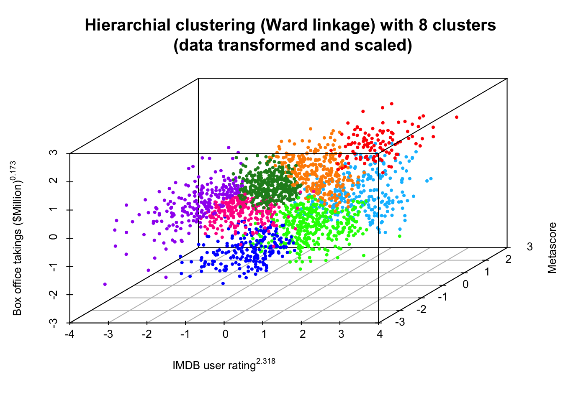

``` r
mean_values <- matrix(unlist(lapply(1:max(hier_ward_cut), function(x) colMeans(imdb_clean_transformed[hier_ward_cut == x,2:4]))), ncol = 3, byrow = TRUE)
colnames(mean_values) <- colnames(imdb_clean_transformed[,2:4])
mean_values<- melt(mean_values)
ggplot(data = mean_values, aes(x = Var1, y = value)) +
  geom_bar(aes(fill = Var2), stat = "identity", position = position_dodge(0.9)) +
  scale_x_continuous(name = "Cluster number", breaks = seq(1, max(hier_ward_cut), 1)) +
  scale_y_continuous(name = "Transformed and scaled values", breaks = seq(-2.5,2,0.5)) +
  scale_fill_discrete(name = "Variables") +
  ggtitle(paste("Mean values of each cluster for hierarchial clustering with k =", max(hier_ward_cut), "\n(Ward linkage; transformed and scaled data)", sep = " ")) +
  theme(panel.background = NULL, plot.title = element_text(hjust = 0.5))
```

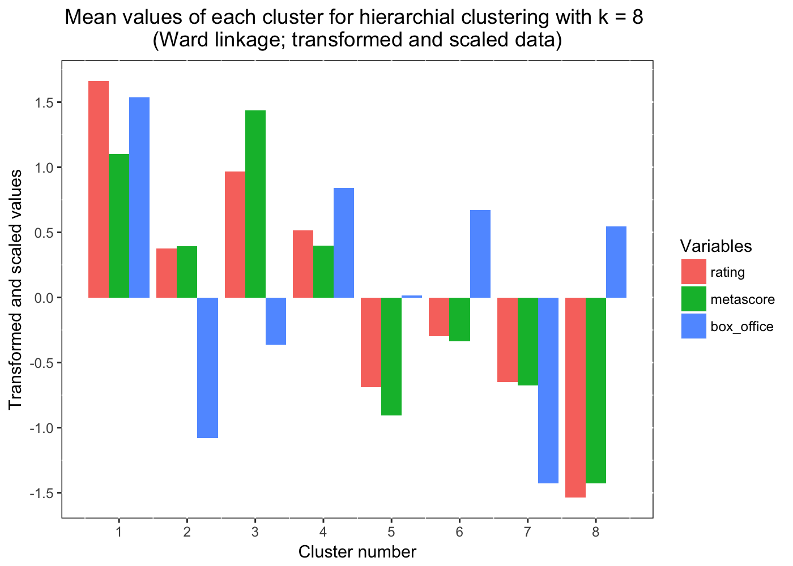

``` r
sapply(1:max(hier_ward_cut), function(x) mean(unlist(imdb_clean_transformed[hier_ward_cut == x,2:4])))
```

    ## [1]  1.43307700 -0.10277876  0.67897451  0.58373374 -0.52679511  0.01266751 -0.91928299 -0.80669215

This clustering analysis seems to build a cluster of successful films, but 2 clusters could be judged as containing the most unsuccessful films.

-   Cluster 1 contains 111 all-round successful films.
    -   User ratings between 7.3 and 9.
    -   Metascores between 48 and 96, with an average of 75.15.
    -   Box office takings between $51.69 million and $936.66 million, with an average of $232.31 million.

``` r
summary(imdb_clean[hier_ward_cut == 1,])
```

    ##     title               rating        metascore       box_office    
    ##  Length:111         Min.   :7.300   Min.   :48.00   Min.   : 51.69  
    ##  Class :character   1st Qu.:7.600   1st Qu.:71.00   1st Qu.:132.25  
    ##  Mode  :character   Median :7.800   Median :75.00   Median :188.37  
    ##                     Mean   :7.849   Mean   :75.15   Mean   :232.31  
    ##                     3rd Qu.:8.000   3rd Qu.:81.00   3rd Qu.:294.49  
    ##                     Max.   :9.000   Max.   :96.00   Max.   :936.66

``` r
head(imdb_clean[hier_ward_cut == 1,], n = 10)
```

    ##                    title rating metascore box_office
    ## 3        The Dark Knight    9.0        82     534.86
    ## 6              Inception    8.8        74     292.58
    ## 9           Interstellar    8.6        74     188.02
    ## 13                  Coco    8.5        81     209.43
    ## 16      Django Unchained    8.4        81     162.81
    ## 17 The Dark Knight Rises    8.4        78     448.14
    ## 19                WALL·E    8.4        95     223.81
    ## 24  Inglourious Basterds    8.3        69     120.54
    ## 25                    Up    8.3        88     293.00
    ## 26           Toy Story 3    8.3        92     415.00

``` r
tail(imdb_clean[hier_ward_cut == 1,], n = 10)
```

    ##                                         title rating metascore box_office
    ## 375              Sully: Miracle on the Hudson    7.5        74     125.07
    ## 419   Star Wars: Episode VIII - The Last Jedi    7.4        85     620.03
    ## 425        Mission: Impossible - Rogue Nation    7.4        75     195.04
    ## 430                                   Lincoln    7.4        86     182.21
    ## 433 The Hobbit: The Battle of the Five Armies    7.4        59     255.12
    ## 443      Mission: Impossible - Ghost Protocol    7.4        73     209.40
    ## 517                           American Hustle    7.3        90     150.12
    ## 520                              Finding Dory    7.3        77     486.30
    ## 521                     The LEGO Batman Movie    7.3        75     175.75
    ## 522                           American Sniper    7.3        72     350.13

-   Cluster 7 contains 204 films that were not very well rated and did badly at the box office.
    -   User ratings between 4.2 and 7, with an average rating of 6.
    -   Metascores between 14 and 61, with an average of 44.12.
    -   Box office takings between $0 million and $3.91 million.

``` r
summary(imdb_clean[hier_ward_cut == 7,])
```

    ##     title               rating        metascore       box_office    
    ##  Length:204         Min.   :4.200   Min.   :14.00   Min.   :0.0000  
    ##  Class :character   1st Qu.:5.700   1st Qu.:38.00   1st Qu.:0.0300  
    ##  Mode  :character   Median :6.100   Median :45.00   Median :0.1300  
    ##                     Mean   :5.996   Mean   :44.12   Mean   :0.3962  
    ##                     3rd Qu.:6.400   3rd Qu.:51.00   3rd Qu.:0.5300  
    ##                     Max.   :7.000   Max.   :61.00   Max.   :3.9100

``` r
head(imdb_clean[hier_ward_cut == 7,], n = 10)
```

    ##                              title rating metascore box_office
    ## 902                         Hesher    7.0        45       0.38
    ## 912        The Magic of Belle Isle    7.0        46       0.10
    ## 1039                  Before We Go    6.8        31       0.04
    ## 1043 Kingsglaive: Final Fantasy XV    6.8        35       0.23
    ## 1055                         Super    6.8        50       0.32
    ## 1057        The Inbetweeners Movie    6.8        44       0.04
    ## 1073          Machine Gun Preacher    6.8        43       0.54
    ## 1074                 Crossing Over    6.8        38       0.45
    ## 1085             The Burning Plain    6.8        45       0.20
    ## 1093       Happythankyoumoreplease    6.8        45       0.22

``` r
tail(imdb_clean[hier_ward_cut == 7,], n = 10)
```

    ##                                     title rating metascore box_office
    ## 2548                          Knock Knock    4.9        53       0.04
    ## 2564                 Survival of the Dead    4.9        43       0.10
    ## 2565              Vanishing on 7th Street    4.9        50       0.02
    ## 2576                           Zombeavers    4.8        44       0.01
    ## 2583                               Ra.One    4.8        60       2.51
    ## 2590                                  ATM    4.7        34       0.00
    ## 2591                    The ABCs of Death    4.7        43       0.02
    ## 2615 The Human Centipede (First Sequence)    4.4        33       0.18
    ## 2625       In the Land of Blood and Honey    4.4        56       0.30
    ## 2648                          V/H/S Viral    4.2        38       0.00

-   Cluster 8 contains 232 films that are badly rated but did not do as badly at the box office as those in cluster 7 did.
    -   User ratings between 1.5 and 6.1, with an average of 5.
    -   Metascores between 7 and 60, with an average score of 31.03.
    -   Box office takings between $0.02 million and $300.53 million, with an average of $58.44 million.

``` r
summary(imdb_clean[hier_ward_cut == 8,])
```

    ##     title               rating        metascore       box_office    
    ##  Length:232         Min.   :1.500   Min.   : 7.00   Min.   :  0.02  
    ##  Class :character   1st Qu.:4.600   1st Qu.:24.00   1st Qu.: 25.17  
    ##  Mode  :character   Median :5.200   Median :32.00   Median : 45.77  
    ##                     Mean   :5.014   Mean   :31.03   Mean   : 58.44  
    ##                     3rd Qu.:5.600   3rd Qu.:37.00   3rd Qu.: 78.91  
    ##                     Max.   :6.100   Max.   :60.00   Max.   :300.53

``` r
head(imdb_clean[hier_ward_cut == 8,], n = 10)
```

    ##                                                 title rating metascore box_office
    ## 1865                   Hansel & Gretel: Witch Hunters    6.1        21      55.70
    ## 1870                                  Bedtime Stories    6.1        33     110.10
    ## 1941                                  Pitch Perfect 3    6.0        40     104.90
    ## 1943                                   Daddy's Home 2    6.0        30     104.03
    ## 1947                                        Grown Ups    6.0        30     162.00
    ## 1949 Teenage Mutant Ninja Turtles: Out of the Shadows    6.0        40      82.05
    ## 1960                                  The Other Woman    6.0        39      83.91
    ## 1962                                      The Tourist    6.0        37      67.63
    ## 1966                                         Get Hard    6.0        34      90.41
    ## 1975                                          Taken 3    6.0        26      89.26

``` r
tail(imdb_clean[hier_ward_cut == 8,], n = 10)
```

    ##                                title rating metascore box_office
    ## 2674                   Jack and Jill    3.4        23      74.16
    ## 2675                   Vampires Suck    3.4        18      36.66
    ## 2677 Bucky Larson: Born to Be a Star    3.3         9       2.33
    ## 2678                 The Emoji Movie    3.1        12      86.09
    ## 2679                     Left Behind    3.1        12      14.00
    ## 2682               Meet the Spartans    2.7         9      38.23
    ## 2683            Dragonball Evolution    2.6        45       9.35
    ## 2686                  Disaster Movie    1.9        15      14.19
    ## 2687         The Hottie & the Nottie    1.9         7       0.03
    ## 2691                Saving Christmas    1.5        18       2.78

Conclusion
==========

Now it would be a good time to try and compare the results from the different clustering analyses. As the primary goal of this project was to identify the most successful all-round films, I am going to focus on this. Using the above methods let's compare the cluster containing the most successful films across all the methods I used.

In order to do this, for the cluster containing the most successful films I am going to look at the mean value for each variable expressed as a proprtion of the maximum value for each variable. Then I'll look at the ratio between these values for the three variables. This should be give me an indication of how well each clustering method uses the three variables when building a cluster.

I could expect that the k-means clustering analysis using the scaled data will have a greater reliance on the `box_office` variable, whereas k-means using the transformed and scaled data should be relatively balanced. The hierarchial methods might produce clusters that are more unbalanced due to the way the algorithm builds the model. However, of the 3 linkages I tried the analysis with Ward linkage is the most closely related to k-means clustering, so I would expect that to also form clusters with a more even balance between the variables.

``` r
colMax <- function(data) sapply(data, max, na.rm = TRUE)
max_scale <- colMax(imdb_clean_scale[,2:4])
max_trans <- colMax(imdb_clean_transformed[,2:4])

km_scale_mean <- (colMeans(imdb_clean_scale[km_8$cluster == 8,2:4])/ 
                    max_scale) / sum(colMeans(imdb_clean_scale[km_8$cluster == 8,2:4])/ max_scale)
km_mean <- (colMeans(imdb_clean_transformed[km_8_trans$cluster == 1,2:4])/ 
              max_trans) / sum(colMeans(imdb_clean_transformed[km_8_trans$cluster == 1,2:4])/ max_trans)
hier_comp_mean <- (colMeans(imdb_clean_transformed[hier_comp_cut == 1,2:4])/ 
                     max_trans) / sum(colMeans(imdb_clean_transformed[hier_comp_cut == 1,2:4])/ max_trans)
hier_avg_mean <- (colMeans(imdb_clean_transformed[hier_avg_cut == 1,2:4])/ 
                    max_trans) / sum(colMeans(imdb_clean_transformed[hier_avg_cut == 1,2:4])/ max_trans)
hier_ward_mean <- (colMeans(imdb_clean_transformed[hier_ward_cut == 1,2:4])/ 
                     max_trans) / sum(colMeans(imdb_clean_transformed[hier_ward_cut == 1,2:4])/ max_trans)

conc_data <- data.frame(method = c("K-means (Scaled data)\n (46 films)", 
                                   "K-means\n (197 films)",
                                   "Hierarchial (complete)\n (112 films)", 
                                   "Hierarchial (average)\n (6 films)", 
                                   "Hierarchial (Ward)\n (111 films)"))
conc_data[,2:4] <- rbind(km_scale_mean, km_mean, hier_comp_mean, hier_avg_mean, hier_ward_mean)
colnames(conc_data)[2:4] <- colnames(imdb_clean_transformed)[2:4]
conc_data <- melt(conc_data, id.vars = "method")
ggplot(data = conc_data, aes(x = method, y = value)) +
  geom_bar(aes(fill = variable), stat = "identity") +
  labs(x = "Method", 
       y = "Proportion that each variable contributes to the cluster", 
       title = "Comparison of clusters containing the most successful\n films from 5 different clustering methods",
       subtitle = "8 clusters were used for all methods. All analyses, except the k-means analysis using scaled data,\n were performed using transformed and scaled data.") +
  geom_hline(yintercept = 0.333, linetype = "dashed") +
  geom_hline(yintercept = 0.667, linetype = "dashed") + 
  scale_y_continuous(breaks = c(seq(0,1,0.2), 0.33, 0.67)) +
  theme(panel.background = NULL, plot.title = element_text(hjust = 0.5), 
        axis.text.x = element_text(angle = 315, hjust = 0))
```

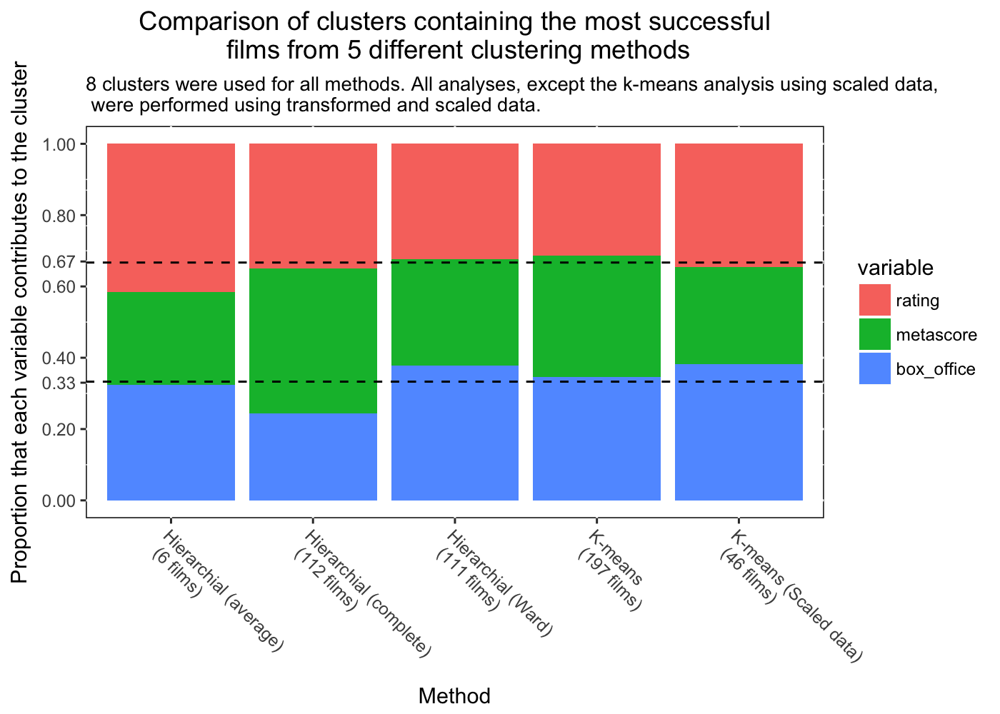

This figure seems to support the hypotheses I discussed above. The k-means analysis with scaled data has a greater reliance on the box office takings, while the k-means analysis with transformed data. The hierarchial clustering analysis with complete linkage relies more on the metascore and less on the box office takings, while the hierarchial analysis with average linkage relies more the user rating and less on the metascore. Hierarchial clustering with Ward linkage seems to give a similar breakdown as k-means clustering. While the methods that produce clusters with an equal reliance on the 3 variables might seem like the better choice on paper, the unequal correlation between the variables shows that this might not necessarily be the case.

``` r
cor(imdb_clean_transformed[,2:4])
```

    ##                rating   metascore  box_office
    ## rating     1.00000000  0.72846375  0.05193133
    ## metascore  0.72846375  1.00000000 -0.04134852
    ## box_office 0.05193133 -0.04134852  1.00000000

Clustering methods like hierarchial clustering with complete linkage seem to be a better fit to this data and the goals of my project as the linkage method uses maximal dissimilarity between clusters. It is worth noting how the number of films in the clusters of most successful films also varies. Hierarchial clustering with average linkage produced a cluster containing just 6 films, k-means clustering with scaled data produced a cluster with 46 films and all other methods produced clusters containing at least 111 films. Varying the number of clusters in these analyses could give completely different cluster sizes.
