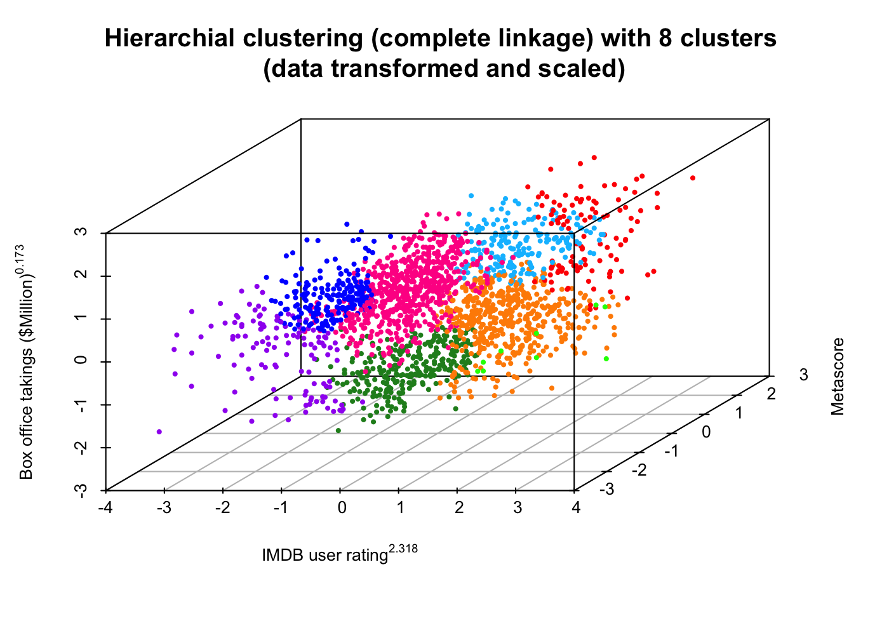

# Clustering-successful-films

Of all the films released over the last 10 years which ones are the most successful? In this project I use k-means and hierarchial clustering methods to try and identify the most successful films based on their ratings by fans and critics and how much money they took at the box office. 

[The project report with integrated R code and figures can be found by clicking here.](IMDB_films.md)

